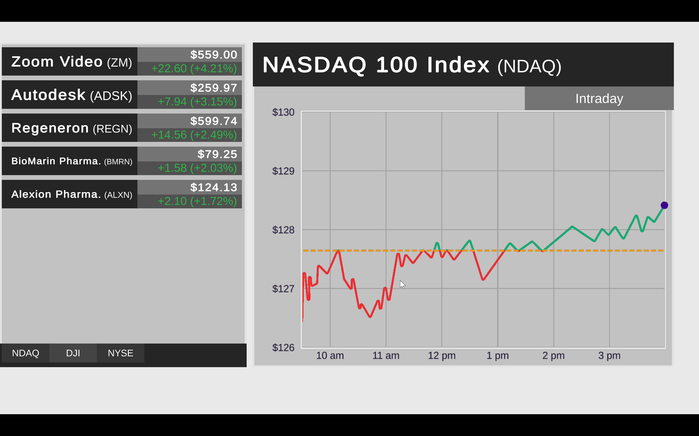

# Case Study: Data Binders

Designed and developed a "No-code" data binder system that allows generic data binding of JSON data to various UGUI components.

---

## Tools & Technologies
- Unity UGUI
- C#  
- JSON 

---

## Role & Responsibilities 
- Designed the code architecture for the system
- Determined and prioritized needed components with mentality towards easy scalling 
- Built modular, data-binder components  
- Built single point of entry component for easy one line consumer implementation
- Built single point of entry component for generating prefabs from JSON array data

---

## Challenge
Creating data-driven graphics generally involves the manual coding of data mapped to various serialized components. This makes the creation of graphics a very programmer first approach and is not very agile. 
This also creates an ever increasing code base to maintain as the graphics increase in scope and new graphics are created.

---

## Solution
Take an MVVM (Model-View-ViewModel) approach and create reusable components that can specify what field from a JSON payload to use and how to bind that data to various UGUI components. 
Each of these binder components would then be attached to a parent Data Binder that would feed them the JSON data provided by the graphic class. 
In this way, the graphic class only has knowledge of the parent binder to allow for the transfer of data. 
This approach abstracts out all of the graphical binding logic from the graphic class and allows for very quick modifications with zero code manipulation once implemented.

---

## Impact
Vastly improved turn-around speed and build stability for graphic modifications/additions and changes to data binding. 
- Before -> days of development time with extra QA required to catch bugs and issues
- After -> hours of integration time with zero QA required since design/data modifications resulted in zero changes to code  

---

## Key Learnings
- Abstracting out data binding logic vastly helps reduce code complexity and improve scalability
- "No-Code" scalable systems like this allow for reduced scope of QA and vastly reduces the amount of code maintenance and chances to introduce new bugs

---

## See for yourself
The demo is fully playable. Simply download as zip, extract and run inside of Unity to explore the system and its implementation.

### Not a developer? Not a Problem!
Simply download this build and you can see the Data Binder system in action.<br>
[Download Game Build](https://github.com/jglasspilon/Data-Binders-Sample/raw/refs/heads/master/Build.zip)

### Steps:
1. Download zip
2. Extract all files
3. Enter unzipped build folder and run app **DataBinderSample.exe**
> Hit Alt+F4 to exit the app

---

# At a Glance
### Runtime Results


---

### Implementation Logic Requires Under 50 Lines of Code
```csharp
public class DataBinderDemo : MonoBehaviour
{
    [SerializeField] //Element that registers data and binds it to all connected dataBinder components
    private DataBinder m_dataBinder;                            

    [SerializeField] //Element that generates and controls a list of dataBinder prefabs
    private DataBinderList m_dataList;                          

    [SerializeField] //Animator that controls the animation of the wipe that covers the chart during data transition
    private Animator m_chartWipe;                               

    // Path (relative to the streaming assets path) pointing to the JSON files
    private const string PATH_TO_JSON_FILE = "/JSONData/";

    // Specifies the JSON file to read from on app start
    private const string STARTUP_DATA = "Nasdaq.json";          

    private void Start()
    {
        SetStartupData();
    }

    private void SetStartupData()
    {
        JSONNode json = FileReader.ReadJSONFromFile(Application.streamingAssetsPath + PATH_TO_JSON_FILE + STARTUP_DATA);
        if (json != null)
            StartCoroutine(ChangeData(json, false));
        else
            Debug.LogError($"JSON file {STARTUP_DATA} does not exist. Could not change data.");
    }

    public void TryChangeData(string JSONFile)
    {
        JSONNode json = FileReader.ReadJSONFromFile(Application.streamingAssetsPath + PATH_TO_JSON_FILE + JSONFile);
        if (json != null)
            StartCoroutine(ChangeData(json));
        else
            Debug.LogError($"JSON file {JSONFile} does not exist. Could not change data.");
    }

    private IEnumerator ChangeData(JSONNode json, bool playAnimation = true)
    {
        m_dataList.GenerateList(json);
        m_dataBinder.RegisterData(json);

        if (playAnimation)
            yield return StartCoroutine(AnimationDispatcher.TriggerAnimation(m_chartWipe, "Play", 0.5f));

        m_dataBinder.BindData(); 
    }
}
```

